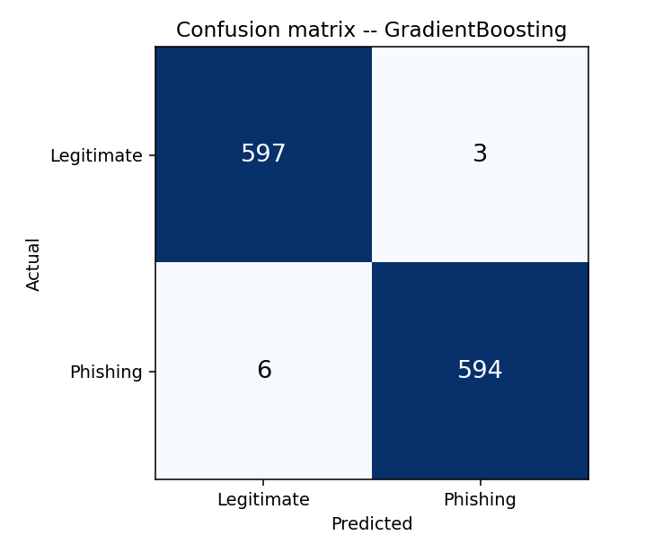
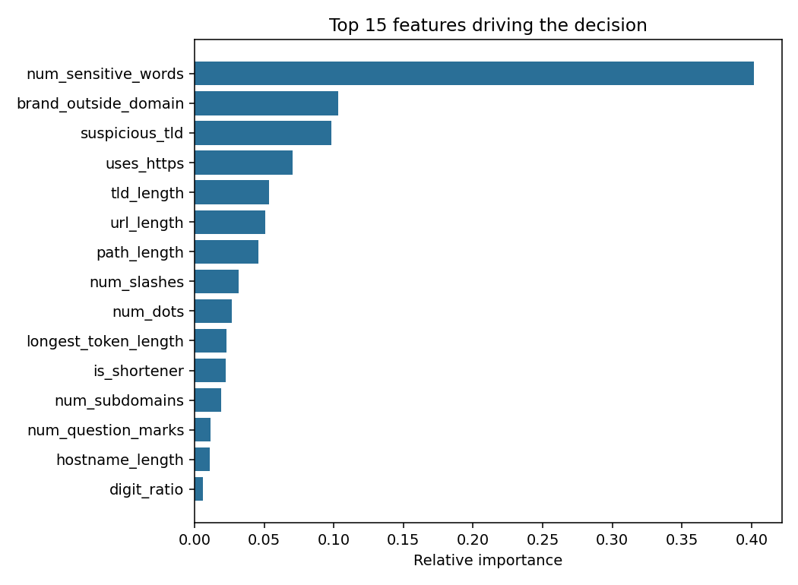

# 08 — Results & Evaluation

*The numbers, what they mean, and — more usefully — the nine URLs the model got wrong.*

---

## 8.1 Headline

Evaluated on **1,200 held-out URLs** never seen during training.

| Model | Accuracy | Precision | Recall | F1 | ROC-AUC | CV F1 (5-fold) |
|---|---|---|---|---|---|---|
| Logistic Regression | 0.9425 | 0.9447 | 0.9400 | 0.9424 | 0.9892 | 0.9568 ± 0.0059 |
| Random Forest | 0.9908 | 0.9933 | 0.9883 | 0.9908 | 0.9997 | 0.9917 ± 0.0028 |
| **Gradient Boosting** | **0.9925** | **0.9950** | **0.9900** | **0.9925** | 0.9996 | 0.9925 ± 0.0014 |

Raw output in `reports/metrics.json`.

> **Before quoting 99.25% anywhere:** this is a synthetic dataset. §8.7 explains exactly what the number does and does not support.

---

## 8.2 Confusion matrix



Gradient Boosting on the 1,200 test URLs:

| | Predicted legitimate | Predicted phishing |
|---|---|---|
| **Actually legitimate** | 597 (TN) | 3 (FP) |
| **Actually phishing** | 6 (FN) | 594 (TP) |

Nine errors out of 1,200: **6 missed phishing sites, 3 false alarms.**

**The two error types are not equally costly.**

- A **false positive** (3 cases) flags a safe site. Cost: a user sees a warning and clicks through, mildly annoyed. Repeated often, it trains people to ignore warnings — a real cost, just a slow one.
- A **false negative** (6 cases) misses a phishing site. Cost: a compromised account.

The model currently errs in the *worse* direction — precision (0.9950) exceeds recall (0.9900), meaning it is more willing to miss phishing than to raise a false alarm. For a security tool that balance is backwards. §8.6 covers fixing it by moving the threshold.

---

## 8.3 Every URL the model got wrong

This is the most useful section in the document. Aggregate metrics tell you *how much* is wrong; the actual errors tell you *why*. All nine:

### The 6 missed phishing sites (false negatives)

| P(phishing) | URL | Generator |
|---|---|---|
| 0.163 | `https://oovdlhtk.web.app/` | `_phish_on_cloud_host` |
| 0.270 | `https://www.steamcare.com/account` | `_phish_clean_lookalike` |
| 0.285 | `https://www.sbiteam.co/` | `_phish_short_https` |
| 0.285 | `https://qmmqknl.glitch.me/` | `_phish_on_cloud_host` |
| 0.368 | `https://www.hdfcteam.co/login` | `_phish_clean_lookalike` |
| 0.478 | `https://www.binanceteam.com/account` | `_phish_clean_lookalike` |

**Every one is short, HTTPS, and on an ordinary TLD.** Take the worst miss:

```
https://oovdlhtk.web.app/          P(phishing) = 0.163
```

| Feature | Value | Reads as |
|---|---|---|
| `uses_https` | 1 | legitimate |
| `url_length` | 25 | short — legitimate |
| `suspicious_tld` | 0 | `.app` is a normal Google TLD |
| `num_sensitive_words` | 0 | no urgency words at all |
| `brand_outside_domain` | 0 | no brand mentioned |
| `path_length` | 1 | just `/` |
| `hostname_entropy` | 3.63 | slightly high, but so are CDN hostnames |

**Every single feature says legitimate.** Short, HTTPS, Google-operated TLD, no path, no brand name. The only weak signal is a mildly random hostname — and `_legit_cloud_host` explicitly taught the model that random hostnames on cloud providers are normal.

This is not a bug; it is the **fundamental limit of lexical analysis**. Nothing in that string is wrong. Catching it needs information the URL does not contain: domain age (registered yesterday), page content (a fake login form), or reputation (never seen before).

The `steamcare.com` / `sbiteam.co` / `hdfcteam.co` cluster fails for a related reason: the brand is fused into the registered domain itself (`steam` + `care`), so `brand_outside_domain` returns 0 — the brand *is* the domain, as far as the feature can tell. Detecting a brand name *embedded in* a domain that isn't the brand's real domain would need the reputation list described in [doc 10](10-future-work.md).

### The 3 false alarms (false positives)

| P(phishing) | URL | Generator |
|---|---|---|
| 0.948 | `https://stackoverflow.com/` | plain legitimate |
| 0.852 | `https://icicibank.com/` | plain legitimate |
| 0.508 | `https://www.paypal.com/signin?country.x=US&locale.x=en_US` | `_legit_real_login` |

**The first two are the most instructive errors in the whole project**, because they are not even hard cases — they're ordinary, top-tier websites.

```
https://stackoverflow.com/     P(phishing) = 0.948
```

| Feature | Value |
|---|---|
| `url_length` | 26 |
| `path_length` | 1 (just `/`) |
| `uses_https` | 1 |
| `num_sensitive_words` | 0 |
| `brand_outside_domain` | 0 |
| `suspicious_tld` | 0 |

Nothing is wrong with it. So why 0.948?

**It's a dataset artifact, and worth being honest about.** Look at where bare-domain URLs come from in the training data:

- Among *legitimate* URLs, only 2 of the 29 path templates are `""` or `"/"` — so roughly 7% are bare domains.
- Among *phishing* URLs, `_phish_short_https` produces bare domains by design (`https://netflixalert.com/`), and `_phish_clean_lookalike` frequently does too.

The model has therefore learned a rule that is true *in this dataset* and false in the world: **"HTTPS + bare domain + no path → phishing."** `stackoverflow.com` and `icicibank.com` match it exactly.

This is a generator flaw, not a modelling flaw, and the fix is in the data: `LEGIT_PATHS` should contain bare domains at something closer to their real-world frequency, since a great many legitimate links point at a site root. It's left in place and documented rather than quietly patched, because it demonstrates something worth demonstrating — **a model will happily learn a spurious correlation, and the only way to catch it is to look at individual errors rather than the aggregate score.** At 99.25% accuracy this flaw is completely invisible in the headline number.

The third false positive, real PayPal's sign-in page at 0.508, is a genuine borderline call: two sensitive words ("signin", "paypal") on a URL with query parameters. It sits essentially on the fence.

---

## 8.4 Uncertain predictions

Nine test URLs land in the low-confidence band (0.35 < p < 0.65):

| Actual | P(phishing) | URL |
|---|---|---|
| PHISH | 0.643 | `https://www.hdfccare.net/verify` |
| PHISH | 0.592 | `https://www.facebook-support.net/account` |
| PHISH | 0.574 | `https://www.spotifyhelp.org/` |
| PHISH | 0.561 | `https://www.hsbccentre.com/login` |
| PHISH | 0.554 | `http://www.officee365.net/support/index.php` |
| PHISH | 0.512 | `https://www.hdfccare.io/` |
| LEGIT | 0.508 | `https://www.paypal.com/signin?country.x=US&locale.x=en_US` |
| PHISH | 0.478 | `https://www.binanceteam.com/account` |
| PHISH | 0.368 | `https://www.hdfcteam.co/login` |

Every one is a **brand-adjacent short URL** — exactly the region where lexical features run out of information. `spotifyhelp.org` (phishing) and `paypal.com/signin` (real) are barely distinguishable as strings; the difference is a fact about the world, not about the text.

Two practical takeaways:

1. **The model knows when it doesn't know.** On these it hovers near 0.5 rather than being confidently wrong. That is the right behaviour, and it's why the output exposes a confidence band rather than only a label.
2. **This band is where a second signal belongs.** In a layered system, URLs scoring 0.35–0.65 are the ones worth spending a WHOIS lookup or a blocklist query on — 9 out of 1,200, so under 1% of traffic. Everything outside the band is already decided cheaply.

Note the asymmetry: 8 of the 9 uncertain URLs are actually phishing. The uncertain band is genuinely enriched for attacks, which is what makes it worth escalating.

---

## 8.5 Feature importance



| Rank | Feature | Importance | Group |
|---|---|---|---|
| 1 | `num_sensitive_words` | 0.402 | Content-aware |
| 2 | `brand_outside_domain` | 0.103 | Content-aware |
| 3 | `suspicious_tld` | 0.098 | Binary flag |
| 4 | `uses_https` | 0.070 | Binary flag |
| 5 | `tld_length` | 0.054 | Content-aware |
| 6 | `url_length` | 0.051 | Size |
| 7 | `path_length` | 0.046 | Size |
| 8 | `num_slashes` | 0.032 | Character count |
| 9 | `num_dots` | 0.027 | Character count |
| 10 | `longest_token_length` | 0.023 | Content-aware |

**The top three carry ~60% of the decision, and all three encode domain knowledge** rather than raw text statistics. That's the central lesson: the hours spent designing `brand_outside_domain` bought more accuracy than any amount of hyperparameter tuning did.

**The 40% on `num_sensitive_words` deserves scepticism, not celebration.** Part of it is real — phishing URLs genuinely are stuffed with urgency words. But part is the generator: phishing paths are drawn from a `PHISH_WORDS` pool, making the signal cleaner than reality. On a real corpus the feature would stay important but wouldn't dominate.

**`url_length` and `path_length` together (~10%) are what produced the `stackoverflow.com` false positive** in §8.3 — they are how the model encodes "bare domain". Their importance is inflated by the same generator imbalance.

**Character counts contribute little individually** (each under 4%) but collectively around 15%. They act as tie-breakers once the semantic features are ambiguous.

---

## 8.6 The threshold trade-off

Default is 0.5. Lowering it catches more phishing at the cost of more false alarms.

| Threshold | Effect on these results |
|---|---|
| 0.30 | Would catch 4 of the 6 missed phishing URLs (all those scoring above 0.30), at the cost of more false alarms |
| 0.50 | Current: 6 FN, 3 FP |
| 0.70 | Fewer false alarms, more misses |

Given that recall (0.9900) currently sits below precision (0.9950) — the wrong way round for a security tool — **lowering the threshold to about 0.35 would be the defensible choice here.** It converts 4 of the 6 misses into catches.

Change it in `predict_one()`:

```python
label = "PHISHING" if probability >= 0.5 else "LEGITIMATE"
```

Choosing the value properly means plotting precision and recall against the threshold and picking the point that matches your tolerance — see [doc 10](10-future-work.md).

---

## 8.7 What these numbers do and do not support

**Supported:**

- The 28-feature lexical approach separates these classes well.
- The decision boundary is **non-linear** — the tree ensembles beat Logistic Regression by 5.0 points, a gap that only appears once hard cases are in the data.
- The pipeline is **correct**: no data leakage (scaling inside the Pipeline), no duplicate contamination (insertion-ordered dedup), fully reproducible (see §8.9), stable across folds (CV σ ≤ 0.006).
- The failure modes are **understood and characterised** — including one that turned out to be a flaw in the data rather than the model.

**Not supported:**

- "This system is 99.25% accurate at detecting phishing." It is 99.25% accurate at separating *this generator's* phishing patterns from *this generator's* legitimate URLs — and §8.3 shows it does that partly by learning a spurious rule about bare domains.
- Any comparison against published results. Different data, so the numbers aren't comparable.
- Deployment readiness. See [doc 05 §5.7](05-architecture.md#57-what-a-production-version-would-add).

**Expected on a real corpus** (PhishTank + Tranco, same features):

| Metric | Here | Realistic |
|---|---|---|
| Accuracy | 0.9925 | 0.93 – 0.96 |
| Precision | 0.9950 | 0.92 – 0.96 |
| Recall | 0.9900 | 0.91 – 0.95 |
| ROC-AUC | 0.9996 | 0.96 – 0.98 |

[Doc 02 §2.6](02-dataset.md#26-swapping-in-a-real-dataset) shows how to run it yourself — it's a one-file change.

---

## 8.8 Sensitivity to dataset difficulty

Test F1 as the share of hard cases changes:

| `hard_fraction` | Logistic Regression | Random Forest | Gradient Boosting |
|---|---|---|---|
| 0.00 | 0.9992 | 1.0000 | 1.0000 |
| 0.30 *(default)* | 0.9424 | 0.9908 | 0.9925 |
| 0.50 | 0.9313 | 0.9892 | 0.9891 |

At 0.00 the tree models are *literally perfect* and the evaluation is worthless — you cannot distinguish three models that all score 1.0000. Reproduce:

```bash
python -m src.dataset --hard 0.0 && python -m src.train
python -m src.dataset --hard 0.3 && python -m src.train
python -m src.dataset --hard 0.5 && python -m src.train
```

Note that going from 0.30 to 0.50 barely moves the tree models (0.9925 → 0.9891) but costs the linear model another point. The ensembles absorb ambiguity; the linear model can't.

**Any phishing-detection result reported without describing how hard the negative class is should be treated with suspicion.** It is trivially easy to construct a dataset on which anything scores 100%.

---

## 8.9 Reproducing everything here

```bash
rm -rf data models reports
python -m src.dataset
python -m src.train
python tests/test_features.py
```

Every number in this document comes out of that, byte-for-byte. Seeds are fixed at 42 in the generator, the split, and all three models.

**One subtlety worth knowing**, because it caused a real bug during development: an earlier version of `build_dataset()` collected URLs in a `set` and then called `list()` on it. Python randomises string hashing per process, so set iteration order is **not** stable between runs — which meant a different train/test split every time, and results that drifted by half a point despite every `random_state` being set. The code looked seeded and wasn't. The fix (a list for order, a set only for membership) is in `src/dataset.py` with a comment explaining it.

If you ever see seeded results that still move between runs, look for a set or a dict being iterated.

---

**Previous:** [07 — Code walkthrough](07-code-walkthrough.md) | **Next:** [09 — Viva questions](09-viva-questions.md)
